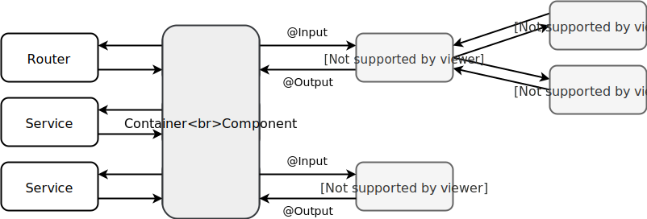

<h1>Cheatsheet</h1>

Author: Sebastian Luther \
Latest revision: 24.12.2019

<h2>Inhaltsverzeichnis</h2>

- [Allgemeines](#allgemeines)
  - [User Stories: Fachliche Anforderungen](#user-stories-fachliche-anforderungen)
- [TypeScript](#typescript)
  - [Klasse VS Interface](#klasse-vs-interface)
  - [Spread Operator](#spread-operator)
  - [Destructuring](#destructuring)
- [Angular](#angular)
  - [Tipps & Tricks](#tipps--tricks)
    - [Zuästzliche CSS-Basispfade](#zuästzliche-css-basispfade)
    - [CSS-Präprozessor für Schematics festlegen](#css-präprozessor-für-schematics-festlegen)
  - [Namenskonvention](#namenskonvention)
  - [Template Syntax](#template-syntax)
  - [Container and Presentational Components](#container-and-presentational-components)
    - [Presentational Components](#presentational-components)
    - [Container Components](#container-components)
  - [Observables & Subscriptions](#observables--subscriptions)
    - [Operatoren](#operatoren)
    - [Memory Leaks](#memory-leaks)
  - [Wissenswertes](#wissenswertes)


## Allgemeines

-----------------------------------------
### User Stories: Fachliche Anforderungen

User Stories werden in der agilen Softwareentwicklung verwendet, um fachliche Anforderungen kurz und verständlich in natürlicher Sprache zu beschreiben. Hierfür kann beispielsweise folgendes Muster verwendet werden:

Als [Rolle] möchte ich [Ziel/Wunsch/Funktion] um [Nutzen]

Eine so spezifizierte Anforderung ist nur grob umrissen, weshalb es gilt diese in einem (persönlichen) Dialog aufzuarbeiten, zu verstehen und mit sogenannten Akzeptanzkriterien anzureichern. Akzeptanzkriterien beschreiben welche Erwartungen eine Story erfüllen muss, sodass diese als erfüllt angesehen werden kann. Ein Beispiel: 

<pre>
Story: Rezepte vorschlagen
 
Als Kochneuling möchte ich eine Liste an zufällig ausgewählten Rezepten vorgeschlagen bekommen, um mich bei der Frage "Was koche ich heute?" zu unterstützen.

- Die Liste zeigt 20 Bücher
- Die Rezepte wurden alle zufällig ausgewählt
- Die Liste kann neu zusammengewürfelt werden
- Es bedarf keiner initialen Sortierung
- Filter- und Sortiermöglichkeiten
</pre>

**Wichtig:** Eine "Gute" User Story zeichnen sich im eigentlichen Sinn dadurch aus, dass nur fachliche Anforderungen beschreiben werden und nicht Lösungswege oder technische Belange. Die obige Beispielstory ist nach dieser Definition somit nicht "gut". Letztendlich ist aber ist die Ausformulierung von User Stories jedem selbst überlassen.


## TypeScript

[TypeScript](https://www.typescriptlang.org/) (TS) ist ein superset der Programmiersprache JavaScript (JS) und basiert auf (zukünftigen) ECMAScript-Standards. Dies bedeutet, dass TS als eine Schicht um JS herum verstanden werden kann, die zusätzliche Features mit sich bringt, wie beispielsweise die statische Typisierung aus der objektorientierten Programmierung.

TS kann nicht im Browser ausgeführt werden, da es sich mit den zusätzlichen Features nicht mehr um reines JS handelt. Deshalb wird TS mit einem Compiler ausgeliefert, welchen TS-Quellode in JS-Code transpiliert. Beim Transpilieren werden alle verwendeten TS-Sprachkonstrukte so umgewandelt, sodass diese nachwievor die selbe Semantik besitzen, jedoch nur mit bordeigenen JS-Mittel.

*Übrigens*: Da TS den existierenden Sprachstandard von TS erweitert, ist jedes JS-Programm ein korrektes TS-Programm, nicht aber umgekehrt!


-----------------------
### Klasse VS Interface

Bei einer Systemarchitektur mit einem Angular-Frontend und einem HTTP-Backend (wie zum Beispiel ein REST-Service) liegt die kritische Geschäftslogik im Backend. Da das Frontend in erster Linie Daten des Backends empfangen, darstellen, verarbeiten und zurücksenden soll, ist es letztendlich nicht notwendig im Frontend die üblichen Ansprüche an Models zu legen wie im Backend. Aus diesem und den daraus ergebenden Vorteilen sind **Interfaces** für Models vorzuziehen:

- Für die Daten vom Server ist kein Mapping auf Klasseninstanzen nötig
- Einfaches kopieren mit Hilfe des Spread-Operators ist möglich
- Bei strikter Verwendung von Interfaces ist das Frontend [NgRx](https://ngrx.io/)-Ready


-------------------
### Spread Operator

Details: [MDN web docs](https://developer.mozilla.org/de/docs/Web/JavaScript/Reference/Operators/Spread_operator)

> Mit der Spread-Syntax kann ein einzelner Ausdruck dort expandiert werden, wo mehrere Argumente (bei Funktionsaufrufen), mehrere Elemente (für Array-Literale) oder mehrere Variablen (für destrukturierende Anweisungen) erwartet werden.
~ [MDN web docs](https://developer.mozilla.org/de/docs/Web/JavaScript/Reference/Operators/Spread_operator)

Problemstellung: Ein Objekt oder ein Array soll so kopiert werden, dass das Original unverändert bleibt, auch dann, wenn die Kopie manipuliert wird.

*Naiver Ansatz:*
```TS
const recipe = { name: 'Steak' };
const copy = recipe;
copy.name = 'Pizza';

console.log(copy); // { name: 'Pizza' }
console.log(recipe); // { name: 'Pizza' }
```

Dieser Ansatz funktioniert nicht, da Variablen im Bezug auf Objekte immer nur eine Referenz auf ein Objekt und nicht das Objekt an sich speichern. Das heißt, dass die Variablen `recipe` und `copy` auf das selbe Objekt zeigen und nicht auf zwei unterschiedliche Objekte (Stichwort "Pass by Value" und "Pass by Reference").

*Lösung mit dem Spread-Operator:*
```TS
1. const recipe = { name: 'Steak' };
2. const copy = { 
3.     ...recipe,
4.     name: 'Pizza'
5. };
6. 
7. console.log(copy);   // { name: 'Pizza' }
8. console.log(recipe); // { name: 'Steak' }
```

In Zeile 2 - 5 wird zuerst ein neues leeres untypisiertes Objekt erzeugt. Mit Hilfe des Spread-Operators werden anschließend 1:1 alle Eigenschaften von `recipe` in das neue Objekt kopiert (Zeile 3). Bei diesem Vorgang ist es möglich Eigenschaftswerte zu überschreiben. In Zeile 4 wird so der Wert von `name` auf `'Pizza'` gesetzt.

**Wichtig:** Als Grundlage für den Spread-Operator dient immer ein leeres untypisiertes Objekt in das die Eigenschaften hineinkopiert werden. Ist das zu klonende Objekt eine Klasseninstanz, so werden nur die Eigenschaften kopiert, nicht aber die Klassenmethoden! 

Der Spread-Operator kopiert alle Eigenschaften - seien es primitive Datentypen (wie ``boolean``, ``number`` oder ``string``) oder Objektreferenzen (nur die Referenz, nicht das Objekt selbst!):

```TS
const person = { 
    name: { first: 'Fred', last: 'Müller' }, 
    age: 22,
};
const twin = { ...person, name: { first: 'Maxi', last: 'Müller' } };
console.log(person); // { name: { first: 'Fred', last: 'Müller' } age: 22 }
console.log(twin); // { name: { first: 'Maxi', last: 'Müller' } age: 22 }
console.log(person.name === twin.name) // false

const copy = { ...person, age: 50 };
console.log(person.name === copy.name) // true
```

Daraus folgt, dass mit einem einfachen Aufruf des Spread-Operator, das vollständige Klonen von Objekten mit deren Unterobjekte nicht möglich ist. Dies liegt daran, dass bei Referenzen die Referenzen und nicht die Objekte selbst kopiert werden! Wenn ein Objekt jedoch nur aus primitiven Eigenschaften aufgebaut ist, so ist ein vollständigen Klonen des Objektes möglich.

Mit dem Spread-Operator lassen sich auch **Arrays kopieren**:

```TS
const numbers = [1, 2, 3, 4, 5];
const a = [0, ...numbers];    // [0, 1, 2, 3, 4, 5]
const b = [...numbers, 6];    // [1, 2, 3, 4, 5, 6]
const c = [0, ...numbers, 6]; // [0, 1, 2, 3, 4, 5, 6]
```


-----------------
### Destructuring

Details: [MDN web docs](https://developer.mozilla.org/de/docs/Web/JavaScript/Reference/Operators/Destrukturierende_Zuweisung)

Mit Hilfe der destrukturierende Zuweisung ist es möglich, Daten aus Arrays oder Objekten zu extrahieren oder, anders ausgedrückt, komplexe Datenstrukturen in einfachere Teile herunterzubrechen.

*Vorher:*
```TS
const person { name: 'Fred Müller', age: 22 };

const name = person.name; // 'Fred Müller'
const age = person.age;   // 22
```

*Nachher:* 

```TS
1.  const person = { name: 'Fred Müller', age: 22 };
2.
3.  const { name, age = 18, height, weight = 72 } = person;
4.  console.log(name);   // 'Fred Müller'
5.  console.log(age);    // 22
6.  console.log(height); // undefined
7.  console.log(weight); // 72
8. 
9.  const numbers = [1920, 1080, 940, 720, 440];
10. const [a, b, ...other] = numbers;
11. console.log(a);    // 1920
12. console.log(b):    // 1080
13. console.log(other); // [940, 720, 440]
```

**Wichtig:** Wird versucht eine Variable zuzuweisen, zu der keine Eigenschaft im destrukturierenden Objekt vorhanden ist, so erhält diese den Wert `undefined` (Zeile 2 und 6). Um `undefined` zu vermeiden, können für diese Variablen Default-Werte definiert werden (Zeile 2 und 7).


## Angular

[Angular](https://angular.io/) ist ein Enterprise-Ready Webframework für die Entwicklung von TypeScript-basierten, modularen, skalierbaren und wartbaren Single-Page-Applikationen. Obwohl Angular den Hauptfokus auf den Browser als Zielplattform legt, kann Angular aber auch beispielsweise auf einem Server und nativ auf mobilen Endgeräten ausgeführt werden.


--------------------
### Tipps & Tricks

#### Zuästzliche CSS-Basispfade

Bei dem Verwenden von CSS-Präprozessoren wie SCSS kann die includePath-Option für gloable Styles und Komponenten genutzt werden. Mit dieser lassen sich zusätzliche Basispfade definieren, die bei Imports mit überprüft werden und erleichert so die Arbeit mit (S)CSS.

Um beispielsweise den Pfad `src/styles` mit aufnehmen zu lassen, ist in der Datei `angular.json` sowohl unter `projects.[project].architect.build` als auch `projects.[project].architect.test` Folgendes zu ergänzen:

```JSON
"stylePreprocessorOptions": {
  "includePaths": [
    "src/styles"
  ]
}
```

(S)CSS-Dateien, die in den unter `includePath` angegebenen Pfade abgelegt sind, können von überall aus importiert werden, ohne die Angabe eines relativen Pfades. Ein Beispiel anhand der Datei `src/styles/_variables.scss`:

```SCSS
// For example in: src/app/home.component.scss

@import '../styles/variables'; // A relative path works still
@import 'variables'; // But now this works as well
```

#### CSS-Präprozessor für Schematics festlegen

Es kann vorkommen, dass Schematics CSS-Dateien generieren, obwohl für das Angular Projekt ein CSS-Präprozessor wie SCSS definiert wurde. Der CSS-Präprozessor für Schematics kann in der Datei  `angular.json` unter `projects.[project].schematics` festgelegt werden: 
 
```JSON
"schematics": {
  "@schematics/angular:component": {
    "style": "scss"
  },
  "@ngrx/schematics:component": {
    "style": "scss"
  }
},
```


--------------------
### Namenskonvention

Details: [Angular Styleguide - Naming](https://angular.io/guide/styleguide#naming)

Angular verfolgt eine strenge Namenskonvention, da die Namensgebung eine wichtige Rolle bei der Wartbarkeit und Lesbarkeit spielt. Kurzfassung der Namenskonvention:

- ``dashed-case``: Dateinamen, Ordner und Selektoren 
- ``UpperCamelCase``: Klassen und Interfaces
- ``lowerCamelCase``: Properties und Funktionen

Beispiele:
```TS
// File: recipe-list.component.ts
@Component({
  selector: 'recipe-list',
  templateUrl: './recipe-list.component.html'
})
export class RecipeListComponent {
  @Input() recipe: Recipe;

  public editTitle(newTitle: string): void {
    //...
  }
}
```

```TS
// File: recipe.model.ts
export interface Recipe {
  //...
}
```

-------------------
### Template Syntax

| Name               | Syntax   | Beispiel                       | Beschreibung                                    |
|--------------------|:--------:|--------------------------------|-------------------------------------------------|
| Interpolation      | ``{{}}`` | ``{{ book.title }}``           | Daten in einem Template anzeigen                |
| Property Binding   | ``[]``   | ``[title]="book.title"``       | Eigenschaften eines DOM-Elements setzen         |
| Attributdirektiven | ``[]``   | ``[isAdmin]``                  | Zusätzliche Logik an ein DOM-Element hängen     |
| Event Binding      | ``()``   | ``(click)="handleClick()"``    | Ereignisse verarbeiten                          |
| Two-Way-Binding    | ``[()]`` | ``[(desc)]="book.desc"``       | Eigenschaften setzen und Ereignisse verarbeiten |
| Strukturdirektiven | ``*``    | ``*ngIf, *ngFor, ...``         | Direktiven die den DOM-Baum verändern           |
| Pipe               | `|`      | `{{ book.title | uppercase }}` | Transformation von Daten                        |

**Wichtig:** Bei der Verwendung von eckigen Klammern, interpretiert Angular das Argument als Ausdruck und nicht als String bzw. Zeichenkette!

```HTML
<book [title]="foo">   <!-- Property 'foo' der Komponente-->

<book title="foo">     <!-- Der String 'foo' -->

<book [title]="'foo'"> <!-- Der String 'foo' -->
```


-------------------------------------------
### Container and Presentational Components

Mit zunehmendem Umfang einer Angular-Anwendung nehmen bei Komponenten die Abhängigkeiten zu (Abhängigkeiten werden über den Konstruktor definiert). Dies zeigt sich insbesondere bei der Austausch- und Testbarkeit von Komponenten, da zusätzliche Abhängigkeiten die Komplexität und Fehleranfälligkeit erhöhen. Dieser Problematik nimmt sich das Konzept der Container und Presentational Components an.

Die Grundidee des Konzeptes ist es die **Zuständigkeiten** unter den Komponenten **aufzuteilen** (Stichwort "Separation of Concerns" und "Single Responsibility Principle"). Die Presentational Components sind ausschließlich für die Darstellung verantwortlich und habe keine Abhängigkeiten. Container Components dagegen hängen von Services ab und verknüpfen Presentational Components. Daher weisen diese im Vergleich zu Presentational Components kein umfangreiches Markup.



Diese Unterteilung der Zuständigkeiten führt in der gesamten Anwendung zu weniger Komponenten mit Abhängigkeiten und zu mehr "dummen" Komponenten die einfach zu testen, warten und auszutauschen sind. deshalb ist dieses Design Pattern auch unter dem Namen "Smart and Dumb Components" zu finden.

#### Presentational Components 


#### Container Components


-------------------------------
### Observables & Subscriptions

Ein Observable ist ein **Datenstrom** für (noch nicht bekannte) Ergebnisse. Ein einfaches Beispiel mit nur einem Ergebnis, stellt die HTTP-Schnittstelle dar. Sendet der Client eine HTTP-Anfrage, so ist das Ergebnis dieser Anfrage erst nach der Antwort des Servers bekannt. Der Aufrufer erhält von der Schnittstelle einen Datenstrom und kann auf dessen Ergebnisse lauschen ("subscribe") und unterdessen beispielsweise eine Ladeanimation anzeigen.

Mehr unter: [RxJS](https://rxjs-dev.firebaseapp.com/)

Um Daten aus einem ``Observable`` zu erhalten, muss der Datenstrom mit ``subscribe()`` abonniert werden. Als Argument wird ein Objekt mit den drei Callback-Funktionen ``next``, ``error`` und ``complete`` erwartet:

```TS
const observer = {
    next: value => console.log('Next:', value),
    error: error => console.error('Error:', error),
    complete: () => console.log('Complete'),
} // Must implement the Subscriber interface

const subscription = aObservable$.subscribe(observer);
//...
subscription.unsubscribe(); // deabonnieren!
```

**Wichtig:** Wer abonniert muss auch deabonnieren, sonst droht ein [Memory Leak](#memory-leaks)! Es gibt jedoch Ausnahmen: Observables von ``HttpClient`` und ``ActivatedRoute`` feuern nur einmalig und sind dann zu Ende. Entsprechend werden Subscriber automatisch abgemeldet.

#### Operatoren

// TODO

#### Memory Leaks

Nicht beendete Subscriptions erzeugen einen Memory Leak. Dies bedeutet unter anderem, dass selbst nachdem eine Komponente zerstört wurde (z.B. bei dem Navigieren auf eine andere Seite), die Daten eines Datenstroms weiterhin fließen.

```TS
ngOnInit() {
    interval(1000).subscribe(e => console.log(e));
    this.router.navigate('/');
}
```

*Lösung mit Subject und ``takeUntil()``*

Diese Lösung beruht auf der Tatsache, dass wenn der Datenstrom eines Observables zu Ende ist, auch 
alle Subscriber deabonniert werden. Dies passiert sowohl bei ``complete`` als auch ``error``. 
Um also Subscriptions nicht manuell deabonnieren zu müssen, reicht es aus den Datenstrom zu beenden.
Um dies zu erreichen kann der Operator ``takeUntil()`` verwendet werden. In diesem Beispiel lauscht dieser auf das ``destroy$`` Subject und beendet den ``aObservable$`` Datenstrom, sobald dieser ein Ereignis von ``destroy$`` erhält.

```TS
private destroy$ = new Subject();

ngOnInit() {
    aObservable$.pipe(
        takeUntil(this.destroy$)
    ).subscribe(e => console.log(e));
}

ngOnDestroy() {
    this.destroy$.next();
}
```

*Lösung mit der Async-Pipe*

Die zu **präferierende** und gleichtzeitig komfortablere Alternative zu einem Subject ist die Verwendung der Async-Pipe des Angular-Frameworks. Diese kümmert sich vollständig um die Verwaltung eines Observables (abonnieren und deabonnieren):

```TS
public recipes$: Observable<Recipe[]>;

ngOnInit() {
    recipes$ = this.recipeService.getAll(); 
    // getAll() returns a Observable of a Recipe Array
}
```
```HTML
<div *ngFor="let recipe of recipes$ | async"> <!-- Async-Pipe -->
  <h3>{{ recipe.title }}</h3>
  <h5>{{ recipe.description }}</h5>
</div>
```


-----------------
### Wissenswertes

- Observables aus HttpClient und ActivatedRoute von Angular feuern nur einmalig und sind dann zu Ende. Entsprechend werden Subscriber auf diese Observables automatisch abgemeldet (Details: [Subscriptions und Memory Leaks](#problem:-Subscriptions-und-Memory-Leaks)).

